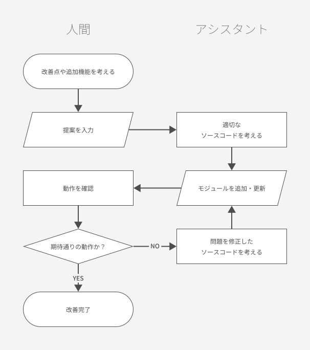

# PlayWithGPT
ChatGPTと遊んでいます。

## 経緯
1. Pythonは全く触ったことがなかったので、web版のChatGPTに質問しながら、APIでChatGPTにつなげる方法を聞きました。
2. つなげるようになったので、API経由で会話しながら「自分のリポジトリを自分で改善できるやつ」を目指してやってます。
3. とりあえず「モジュールを追加する」ことはできるようになりました。

## 始め方
1. .env.exampleファイルを.envにリネームして、自分のAPIキーを入れる。（とりあえずpineconeはまだ不要）
2. main.pyを実行する。
3. セッション形式、翻訳形式、対話相手の名前を入力する。
4. 例えば「one-on-oneセッション、翻訳なし、traveler」を指定すると、異世界旅行者との対話ができます。

## できること
- APIにつなげて、いろんなbotと会話できます。
- 例えば、assistantは優秀なPythonのプログラムアシスタントとして振る舞います。「～～というコードを書いて。ファイル名はfileName.pyで。」と頼むと、（多分）注文した内容のfileName.pyを生成します。これは上書き生成なので、コードの改善も可能です。
- logフォルダ以下には、これまでの自分とChatGPTとの会話が残っていて、読めます。
- セッション形式を「自動タスク処理」にすると、tasksディレクトリに保存されたtaskを自動的に実行する（現状ではcodesとtestsのみ）

## Botリスト
- assistant : Pythonの専門家。モジュールを生成できる。モデル：gpt-3.5-turbo
- traveler : いろんな異世界を冒険した探検者。冒険譚を話してくれる。モデル：gpt-3.5-turbo
- coder : 自動タスク用。Pythonコードを返す。モデル：gpt-4
- test_coder : 自動タスク用。Pythonテストコードを返す。モデル：gpt-4

## フローチャート
assistantとのモジュール生成による、リポジトリの改善例
  

## さしあたっての目標
1. 人間が関わらなくてもコードの追加・改善ができるようになること
2. 何らかの大雑把な命令に対して、追加機能の提案をbot自身で行うこと

## 究極の目標
1. ユーザーが「taskNameをやっておいて」と一言伝える
2. 現時点で解決可能なタスクと、不可能なタスクに分ける
3. 現時点で解決可能なタスクをすべて実行する
4. 不可能なタスクに対し、必要になる追加機能を洗い出す
5. 必要な追加機能をpythonモジュールでリポジトリに追加し、実行可能にする
6. 結果、不可能なタスクが解決可能になったら、全て解決する
7. 1-6を繰り返すことで、万能命令解決リポジトリになる（のか？）